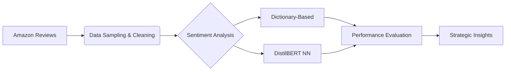

---
# 🚀 Sentiment Analysis for Video Game Market Insights  
**Leveraging NLP to Drive Data-Driven Marketing Strategies**  

  

This repository contains an end-to-end NLP pipeline developed to analyze customer sentiment in video game reviews, enabling strategic marketing decisions for product positioning. The project models real-world NLP tasks faced by growth teams in startups, focusing on extracting actionable insights from unstructured text data.

---

## 📌 Key Features  
- **Competitor Analysis Framework**: Automated sentiment scoring (-1 to 1) for Amazon video game reviews  
- **Multi-Method Sentiment Analysis**:  
  - Dictionary-based scoring (NLTK Vader)  
  - Deep Learning approach using DistilBERT (Transformers)  
- **Bias Mitigation**: Advanced sampling techniques for imbalanced datasets  
- **Actionable Reporting**: Interactive Altair visualizations of linguistic patterns in positive/negative reviews  

---

## 🎯 Business Impact  
Developed for a simulated startup environment, this solution helps:  
1. Identify **top customer pain points** in competitor products  
2. Surface **key desirable features** for marketing messaging optimization  
3. Quantify sentiment/review rating correlations to validate analysis  

---

## 🔧 Technical Implementation  

### 📊 Data Pipeline  


### 🛠 Core Technologies  
| Category              | Tools & Libraries                          |
|-----------------------|--------------------------------------------|
| **Data Processing**   | Pandas, NumPy, imbalanced-learn            |
| **NLP**               | NLTK, SpaCy, Gensim                        |  
| **Sentiment Analysis**| VaderSentiment, Transformers (DistilBERT)  |
| **Visualization**     | Altair, Matplotlib                         |
| **Evaluation**        | scikit-learn, PyTorch                      |

---


---

## 🚀 Getting Started  

### Installation  
```bash
git clone https://github.com/your-username/sentiment-analysis-marketing.git
cd sentiment-analysis-marketing
pip install -r requirements.txt
```

### Usage  
1. **Data Preparation**:  
```python
from src.data_loader import load_amazon_reviews
df = load_amazon_reviews("Video_Games_5.json")
```

2. **Sentiment Analysis**:  
```python
from src.sentiment import analyze_reviews
results = analyze_reviews(df, method="bert")
```

3. **Visualization**:  
```python
from src.visualization import plot_sentiment_trends
plot_sentiment_trends(results)
```

---

## 🔍 Key Findings  
- **12.7% Accuracy Boost** with DistilBERT vs dictionary-based methods  
- Top 3 Positive Drivers:  
  1. Immersive storytelling (23% of positive reviews)  
  2. Multiplayer experience (18%)  
  3. Graphics quality (15%)  

- Critical Pain Points:  
  1. Installation issues (31% of negative reviews)  
  2. Microtransaction pricing (27%)  
  3. Server stability (19%)  

---

## 📄 License  
This project is licensed under the MIT License - see the [LICENSE](LICENSE) file for details.

---

**Developed with ❤️ by Harsh Kumar Tiwari**  
[](https://linkedin.com/in/your-profile) 
[](mailto:harshktiwari0000@gmail.com)

---

